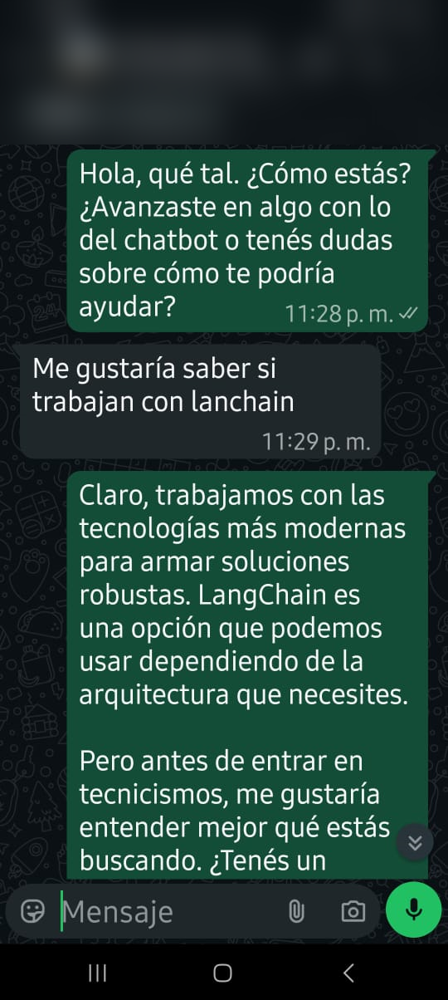
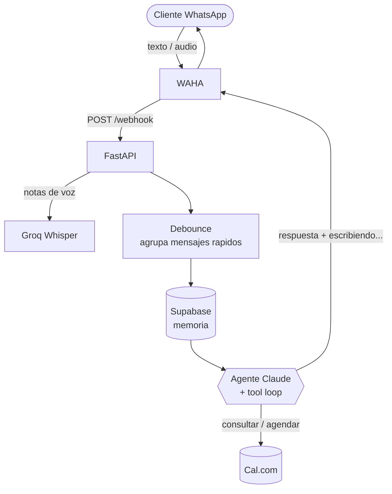

# Chatbot Varka — Agente de WhatsApp con IA


Asistente conversacional de WhatsApp ("Sofía") para **Varka**, consultora de IA y automatización para pymes. Atiende a los clientes 24/7, hace **venta consultiva** (descubrimiento antes de proponer), responde **texto y notas de voz**, y **reserva reuniones reales en Cal.com** por su cuenta.

Construido como un **agente Python liviano** sobre el SDK oficial de Anthropic (sin frameworks pesados), pensado para correr barato y simple en un webhook multiusuario.

<p align="center">
  
  <br>
  <em>Sofía reconduce hacia el descubrimiento en vez de irse a los tecnicismos.</em>
</p>

## Qué hace

- **Conversa con memoria**: recuerda el historial de cada contacto (Supabase) y retoma charlas iniciadas por otros canales.
- **Venta consultiva, no agresiva**: pregunta por el negocio y la necesidad antes de proponer nada.
- **Entiende audios**: transcribe las notas de voz (Groq Whisper) y las responde como texto.
- **Agenda sola**: consulta disponibilidad y reserva el diagnóstico gratuito en Cal.com mediante *tool use*.
- **Se siente humano**: agrupa mensajes rápidos (debounce) y responde con indicador de "escribiendo…" y una pausa proporcional al largo.
- **Califica leads** internamente para priorizar.

## Arquitectura



El bucle de tools es manual: `client.messages.create(..., tools=[...])` y `stop_reason == "tool_use"`. Sin overhead de frameworks, con prompt caching del system prompt y control total del costo por mensaje.

## Stack

- **Python 3.12** · **FastAPI** + **uvicorn** (webhook)
- **Anthropic SDK** — Claude Haiku 4.5
- **httpx** (async) para todas las integraciones
- **Supabase** (PostgREST) — memoria de conversación
- **WAHA** — gateway de WhatsApp
- **Groq Whisper** — transcripción de voz
- **Cal.com API v2** — reservas reales
- **Docker** — deploy (EasyPanel)

## Estructura

```
├── main.py          # webhook FastAPI: filtra, normaliza, orquesta
├── agent.py         # system prompt de Sofía + loop de tools con Claude
├── tools.py         # 3 tools: disponibilidad, agendar, calificar
├── memory.py        # memoria de conversación en Supabase
├── waha.py          # envío a WhatsApp (con "escribiendo…")
├── transcribe.py    # transcripción de audios (Groq)
├── debounce.py      # agrupa mensajes rápidos (asyncio)
├── config.py        # configuración por variables de entorno
├── Dockerfile
└── requirements.txt
```

## Cómo correrlo

```bash
python -m venv venv
venv\Scripts\activate            # Windows ; en Linux/Mac: source venv/bin/activate
pip install -r requirements.txt

cp .env.example .env             # completar con tus credenciales
uvicorn main:app --host 0.0.0.0 --port 8000
```

Apuntá el webhook de WAHA a `https://tu-host/webhook`. Toda la configuración (claves, hosts) se carga por variables de entorno — no hay nada hardcodeado en el código.

## Notas de diseño

- **El no-re-saludo es determinístico**: si hay historial, se inyecta una instrucción explícita en el mensaje del usuario (no en el system prompt) para no invalidar el prompt caching.
- **Teléfono canónico**: los números se normalizan (resuelve `@lid`, saca el `9` argentino) para que la memoria matchee siempre el mismo contacto.
- **Resiliencia**: cada integración tiene fallbacks; un error en una tool nunca tumba el bot (vuelve como texto al modelo).

---

Proyecto de portfolio de **[Varka](https://varka.tech)** · Consultoría de IA y automatización.